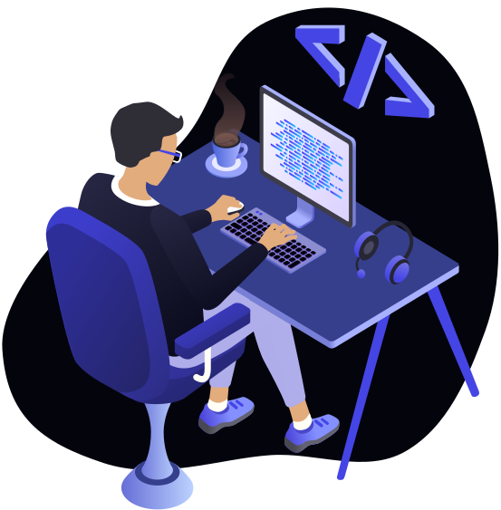

## Hey old sport, I'm Gustavo Macedo!

I'm a FullStack Developer, focusing on the React/NodeJS ecosystem. Graduated as Bachelor of Information Technology at Univesp. With 5 years of experience as a Computer Technician.

 

### Tech Stack

        
